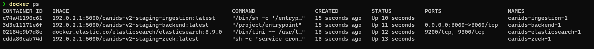
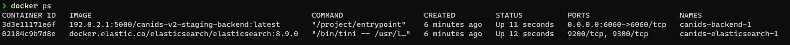
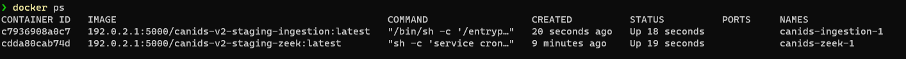
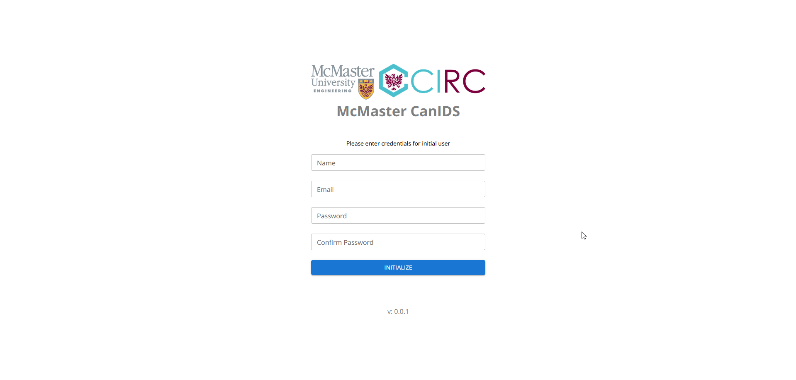

# Fyelabs CanIDS User Manual

This manual will explain the process for deploying CanIDS in two different topologies, as well as the initial configuration of the CanIDS backend once the application has been deployed.

To deploy CanIDS, the user must have access to the CanIDS github repository at https://github.com/mcmaster-circ/canids, which will contain the configuration files required for deployment. The server that CanIDS will be deployed to must have Docker installed.

The two deployment topologies are as follows:

## Standalone Deployment

In the standalone deployment of CanIDS, the software will only monitor the network traffic on a single machine. This configuration corresponds to the `deploy-standalone.yml` configuration file in the Git repository.

The standalone deployment only deploys a single ingestion client, on the same server as the backend and elasticsearch instances, and ingest all network traffic on this server to Zeek, with no filters to exclude CanIDS traffic.

### Instructions

1. Copy the `deploy-standalone.yml` configuration file to the server. Note the location this file has been copied to on that server

2. Connect to the desired server, navigate to the directory containing the `deploy-standalone.yml` file.

3. Execute the command `docker compose -f deploy-standalone.yml up -d` to deploy CanIDS to the server. This command will take some time to execute

4. Once the command has completed, the deployment can be verified using `docker ps`. Four containers will have been created 

   

5. The CanIDS backend will be accessible on port 6060 of the host machine. The backend can be exposed to the internet using a reverse proxying webserver, an example of which is provided below.

## Distributed Deployment

In the distributed deployment of CanIDS, the backend server will not be deployed with an ingestion client. Ingestion clients can be deployed on other desired servers, and target the single backend to ingest all traffic to one centralized dashboard. This configuration corresponds to the `deploy-distributed-backend.yml` and `deploy-distributed-ingestion.yml` configuration files in the Git repository.

### Instructions

1. Copy the `deploy-distributed-backend.yml` configuration file to the desired backend server. Note the location this file has been copied to on that server
2. Connect to the desired server, navigate to the directory containing the `deploy-distributed-ingestion.yml` file.
3. Execute the command `docker compose -f deploy-distributed-backend.yml up -d` to deploy the CanIDS backend and database to this server. This command will take some time to execute.
4. Once the command has been completed, the deployment can be verified using `docker ps`. Two containers will have been created
   
5. The CanIDS backend will be accessible on port 6060 of the host machine. The backend can be exposed to the internet using a reverse proxying webserver, an example of which is provided below.
6. Open `deploy-distributed-ingestion.yml` with a text editor, and modify line 6, replacing `<BACKEND HOST>` with the connection information for the host of the CanIDS backend server (This may be a url, such as `https://canids.example.com/websocket/`, or a host/port pair such as `http://192.168.0.2:6060/websocket/`)
   * In order to avoid traffic between the CanIDS backend and ingestion clients being ingested by zeek, a filter should be added by modifying the `ZEEK_CMD=` environment variable in this configuration file. An example configuration would be `ZEEK_CMD=-f "not (src net 192.168 and dst net 192.168)"` to only ingest network traffic that is not traffic internal to the 192.168.0.0/16 subnet. The filter syntax provided to zeek is described in [pcap-filter(7)](https://linux.die.net/man/7/pcap-filter).
   * Note: This is only a concern if traffic is routed outside docker networks, as traffic contained within docker networks is not ingested by Zeek.
7. On each server that should be monitored by this CanIDS instance, copy the `deploy-distributed-ingestion.yml` configuration file, nothing the location it has been copied to
8. Navigate to the location on the monitored server, and execute the command `docker compose -f deploy-distributed-ingestion.yml up -d` to deploy the ingestion client and Zeek network monitor to that server. This command will take some time to execute
9. Once the command has been completed, the deployment can be verified using `docker ps`. Two containers will have been created
   


# Post-Deployment configuration

## Initial Backend Configuration

On first launch of the CanIDS backend, navigating to the webserver will lead to the configuration landing page. This allows the user to create an initial admin account, before redirecting to the dashboard.



Any further account creations must be approved by an admin user prior to gaining access to the dashboard.

## Approving ingestion clients

## Reverse proxying the backend

If exposing the backend dashboard to the internet is desirable, a reverse proxying webserver can be used. An example configuration for the [Caddy](caddyserver.com/) webserver is provided, which will route traffic from `canids.example.com` to the CanIDS backend.

```
canids.example.com {
	reverse_proxy localhost:6060
}
```


